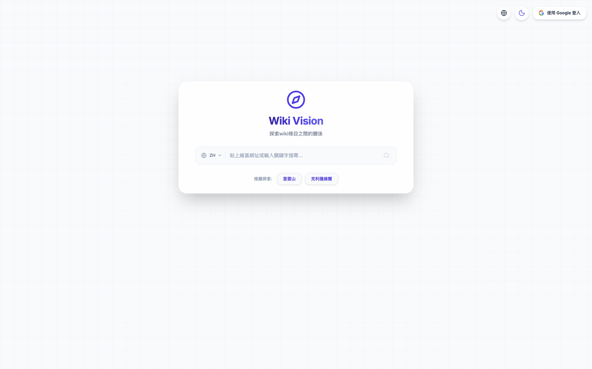
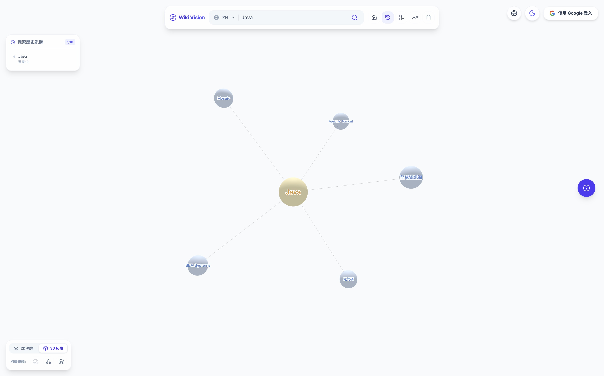
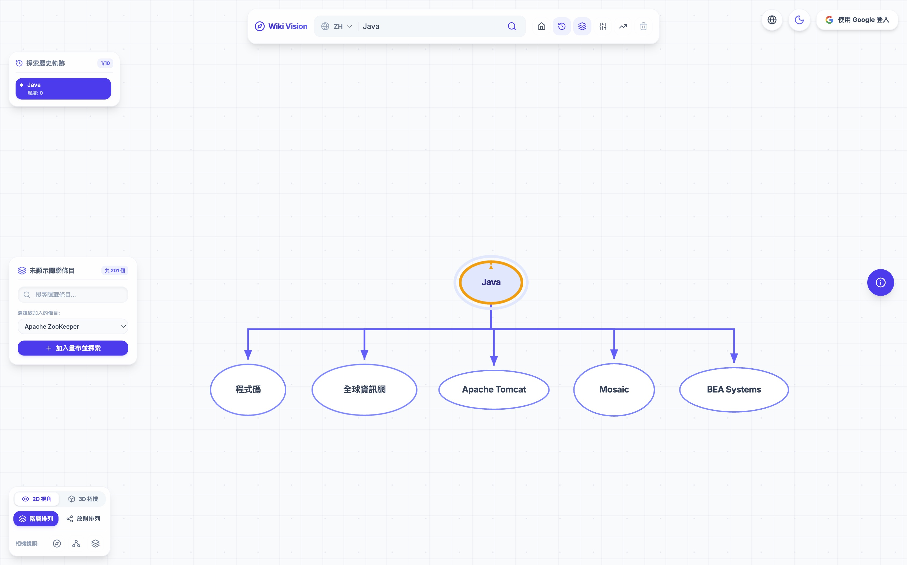
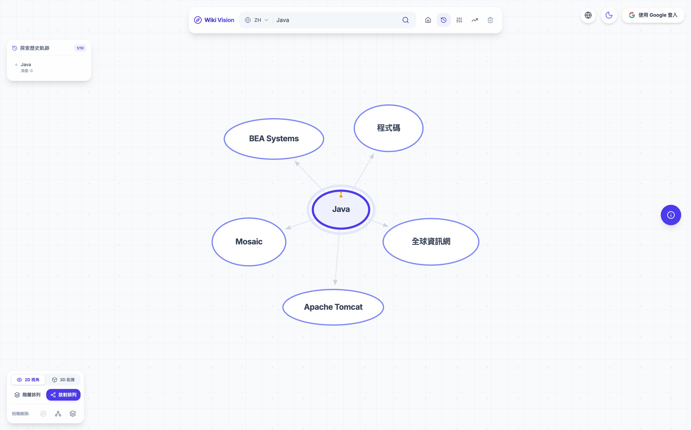
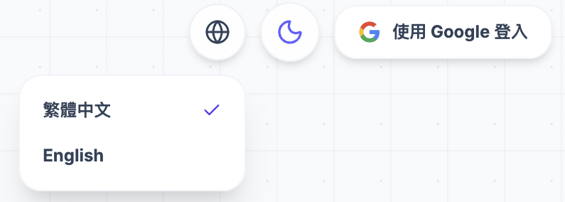

# Wiki Vision 網站使用介紹

Wiki Vision 是一個將維基百科條目視覺化為關聯圖的網頁應用程式，讓使用者能夠以直覺、生動的方式探索知識網路。

## 系統介面概覽

一進到網站，您可以透過主搜尋框輸入感興趣的維基百科條目名稱來開始您的探索之旅。

---

## 操作與使用方式

1. **搜尋主題**：在畫面上方的搜尋框輸入您想探索的維基百科條目（例如「黑洞」或「人工智慧」），按下 Enter 或是搜尋按鈕。
2. **圖表互動**：
   - **平移與縮放**：使用滑鼠左鍵拖曳背景可以平移整個圖表；使用滾輪可以縮放畫面大小。
   - **拖曳節點**：在力導向圖模式中，您可以按住左鍵拖曳特定的節點來改變它的位置，或是將它固定在畫面上。
3. **探索節點**：
   - **懸停預覽**：將滑鼠移到任何一個節點上方，會浮現該條目的快速預覽卡片（包含圖片與簡介）。
   - **查看詳細資訊**：點擊任何節點，右側會滑出詳細資訊面板，讓您閱讀更完整的維基百科摘要，並可以點擊連結直接前往維基百科原頁面。
   - **節點分支鎖定**：如果您希望某個節點延伸出的關聯分支能持續保持展開、固定在畫面上，您可以點擊節點旁的鎖定圖示，或是在該節點的詳細資訊面板中開啟「保持此分支網路展開 (鎖定)」功能。
   - **節點數量**：可以設定節點展開子節點時，要一次最多顯示多少個子節點

---

## 圖表視覺化模式

Wiki Vision 提供多種視覺化排版方式，可透過控制按鈕開啟模式選單進行切換：

### 1. 力導向圖
預設模式。呈現節點間的引力與斥力，適合觀察整體的群集現象與核心節點。

### 2. 樹狀圖
以階層方式展示節點，適合觀察條目之間的從屬與上下層級關係。

### 3. 放射狀
以搜尋主題為中心向外發散的方式展示，適合觀察核心條目向外延伸的所有關聯。

相機鏡頭設定可以將畫面聚焦到選擇的節點、選擇的節點以及他的子節點、整個圖
---

## 探索與互動

### 狀態追蹤面板
當您搜尋條目時，系統會即時顯示目前節點的爬取與解析進度，讓您隨時掌握資料讀取狀態。

### 節點懸停預覽
將滑鼠游標停留在任何節點上，即可快速預覽該條目的維基百科簡介圖片與文字。

### 節點詳細資訊面板
點擊節點後，會從側邊滑出詳細資訊面板，包含更完整的維基百科摘要內容、圖片，以及可直接連往維基百科頁面的相關連結。

---

## 使用者與雲端存檔功能

### 使用者個人選單
登入後，您可以在右上角的選單中管理您的雲端存檔，以及在深色/淺色主題之間切換，提供最舒適的閱讀體驗。

### 歷史存檔紀錄
可以將瀏覽紀錄儲存起來。

---

## 系統設定

透過設定面板，您可以依照需求客製化您的搜尋體驗：
- **搜尋語言**: 選擇要搜尋的條目語言(EN、ZH、JA)，搜尋的條目就會以該語系的wiki條目來搜尋
- **節點數量上限**: 限制每個分支或總共加載的節點數量，以控制畫面複雜度。開啟全部顯示後會顯示該條目所有的子條目。

- 未登入

- 已登入

也能設定GUI和風格：
